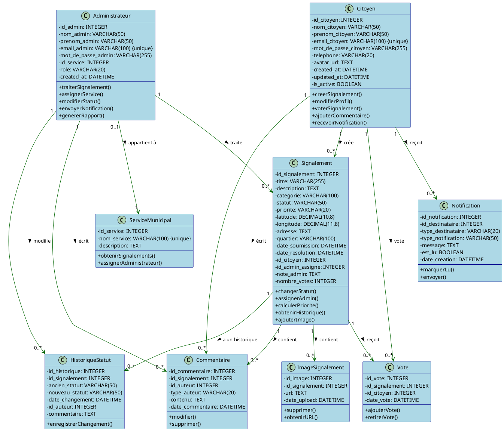
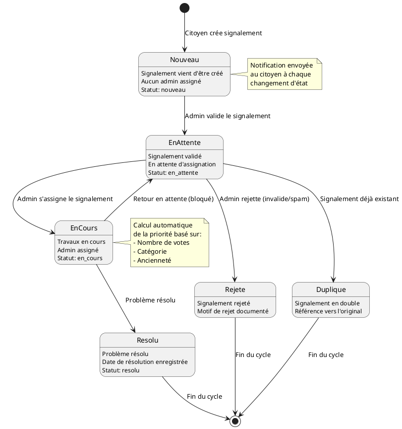
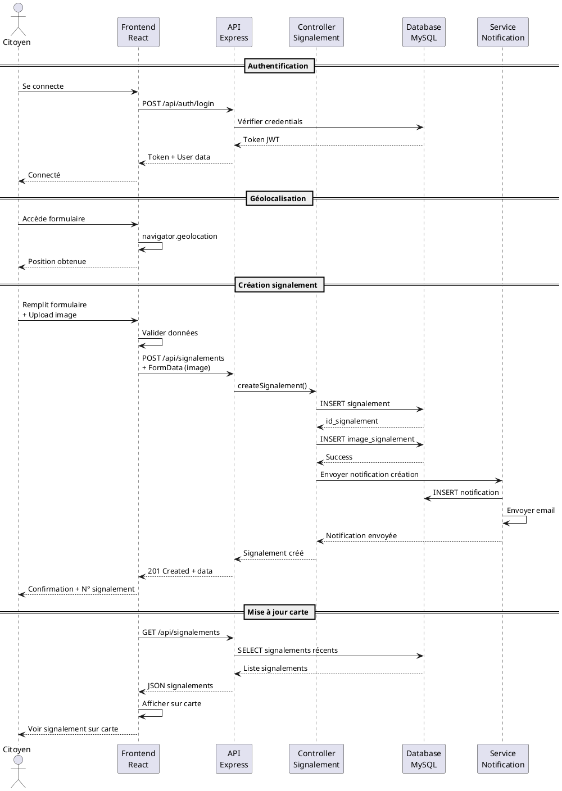
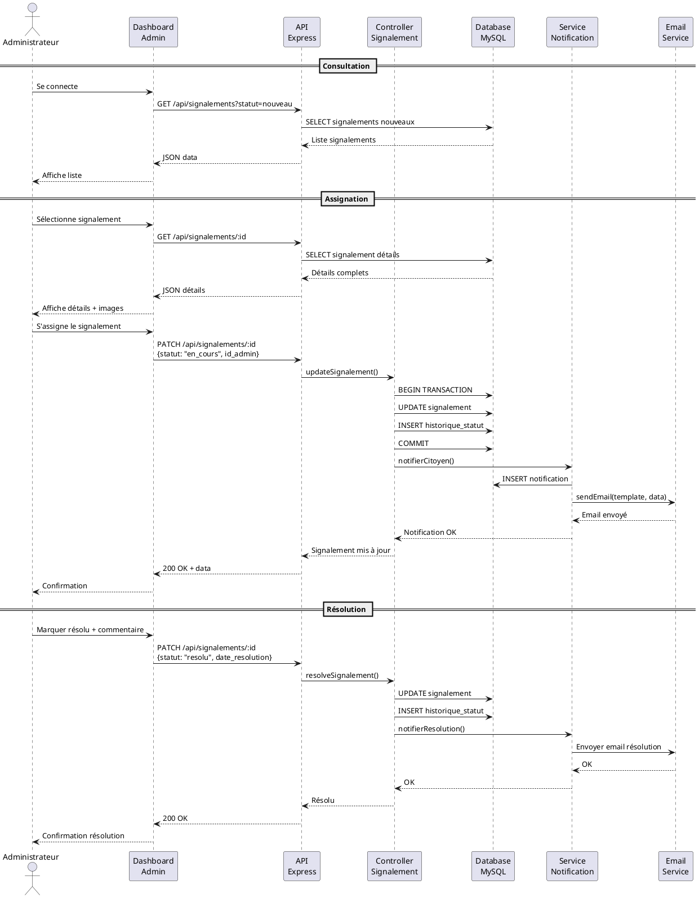
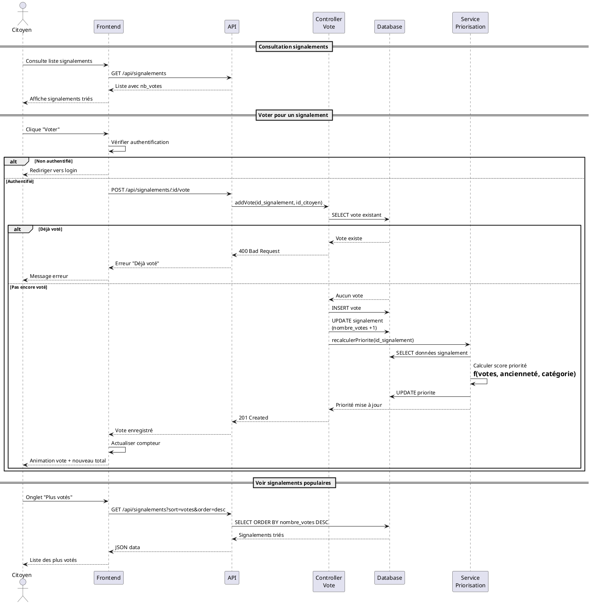
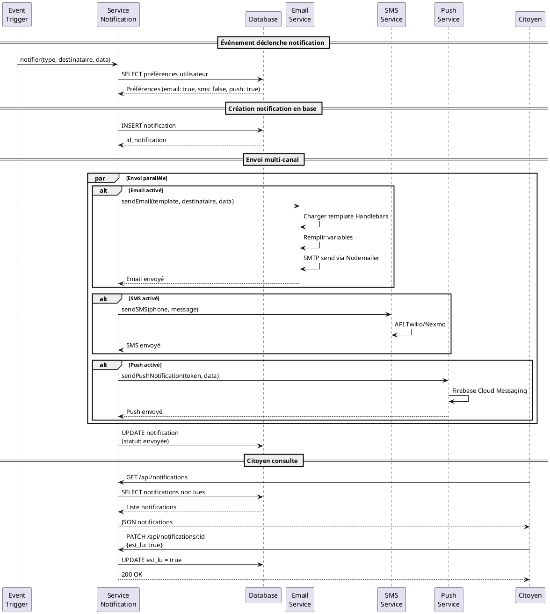
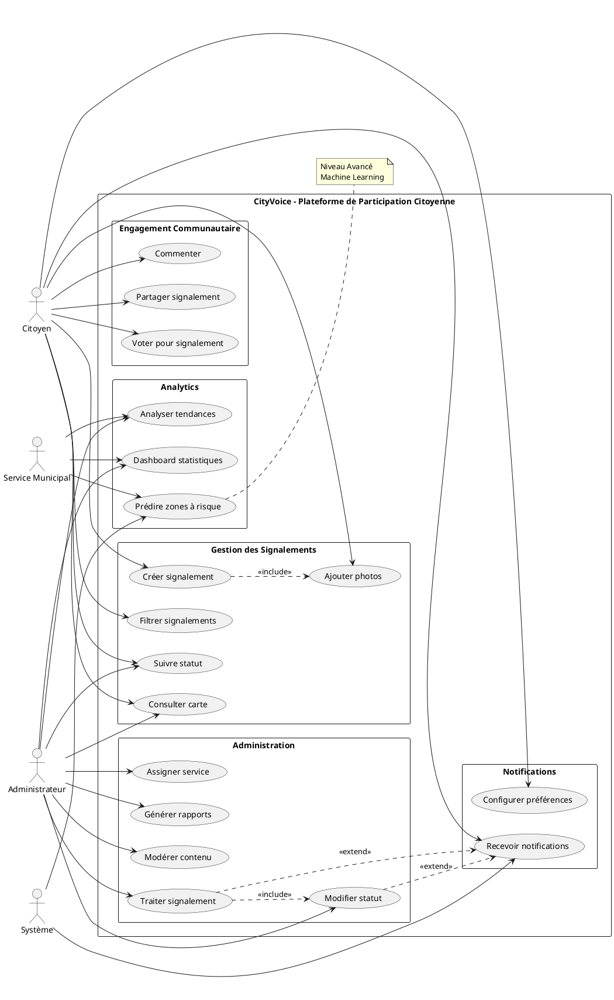
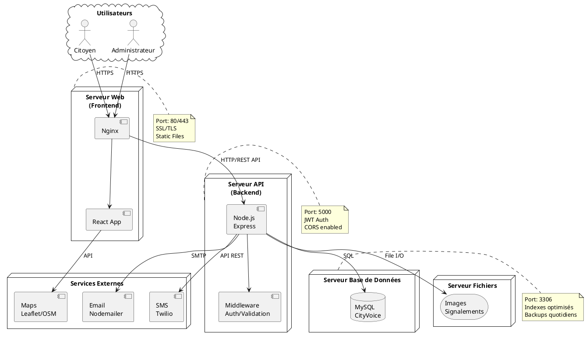
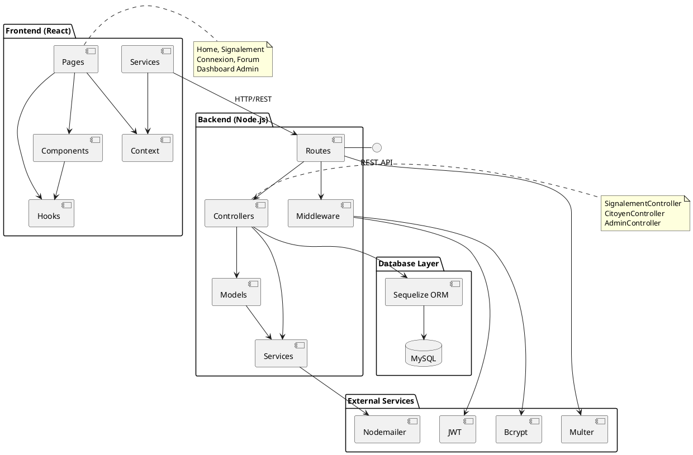

# 📐 Diagrammes UML - CityVoice

**Livrables UML pour la plateforme de participation citoyenne**

---

## 1. 📊 Diagramme de Classes

### Vue d'ensemble des entités principales



---

## 2. 🔄 Diagramme d'États - Cycle de vie d'un Signalement

### États et transitions du signalement



### Matrice de transitions d'états

| État Actuel | Action | État Suivant | Acteur |
|-------------|--------|--------------|--------|
| Nouveau | Valider | En Attente | Administrateur |
| Nouveau | Rejeter | Rejeté | Administrateur |
| En Attente | Assigner | En Cours | Administrateur |
| En Attente | Marquer doublon | Dupliqué | Administrateur |
| En Cours | Résoudre | Résolu | Administrateur |
| En Cours | Bloquer | En Attente | Administrateur |

---

## 3. 📝 Diagramme de Séquence - Création d'un Signalement



---

## 4. 🔄 Diagramme de Séquence - Traitement par Administrateur



---

## 5. 🗳️ Diagramme de Séquence - Vote Communautaire



---

## 6. 🔔 Diagramme de Séquence - Système de Notifications



---

## 7. 📊 Diagramme de Cas d'Utilisation



---

## 8. 🏗️ Diagramme de Déploiement



---

## 9. 📦 Diagramme de Composants



---

## 📖 Guide d'utilisation des diagrammes

### Pour PlantUML

1. **Installation**:
   ```bash
   npm install -g node-plantuml
   # ou
   brew install plantuml  # macOS
   ```

2. **Génération des images**:
   ```bash
   plantuml UML_DIAGRAMS.md
   ```

3. **VS Code Extension**:
   - Installer "PlantUML" extension
   - Preview: `Alt+D`

### Outils en ligne
- [PlantText](https://www.planttext.com/)
- [PlantUML Online](http://www.plantuml.com/plantuml/)

### Export formats
- PNG (raster)
- SVG (vectoriel)
- PDF (documentation)

---

## 📝 Explications des Diagrammes

### 1. Diagramme de Classes
**Objectif**: Modéliser la structure statique du système
- Relations entre entités
- Attributs et méthodes
- Cardinalités

### 2. Diagramme d'États
**Objectif**: Cycle de vie d'un signalement
- États possibles
- Transitions et événements
- Actions sur changement d'état

### 3-6. Diagrammes de Séquence
**Objectif**: Interactions temporelles entre composants
- Création signalement
- Traitement administrateur
- Vote communautaire
- Notifications

### 7. Diagramme de Cas d'Utilisation
**Objectif**: Vue fonctionnelle du système
- Acteurs et rôles
- Fonctionnalités principales
- Relations entre cas

### 8. Diagramme de Déploiement
**Objectif**: Architecture physique
- Serveurs et composants
- Protocoles de communication
- Ports et sécurité

### 9. Diagramme de Composants
**Objectif**: Architecture logicielle
- Organisation du code
- Dépendances
- Interfaces

---

## 🎯 Utilisation dans le Projet

### Documentation
- Onboarding nouveaux développeurs
- Architecture reviews
- Documentation technique

### Développement
- Référence pour implémentation
- Validation des workflows
- Tests (base pour scénarios)

### Communication
- Présentations stakeholders
- Spécifications techniques
- Formation utilisateurs

---

**Version**: 1.0.0  
**Date**: 25 novembre 2025  
**Auteur**: CityVoice Team
